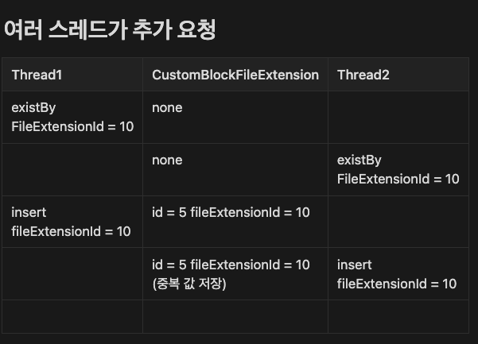
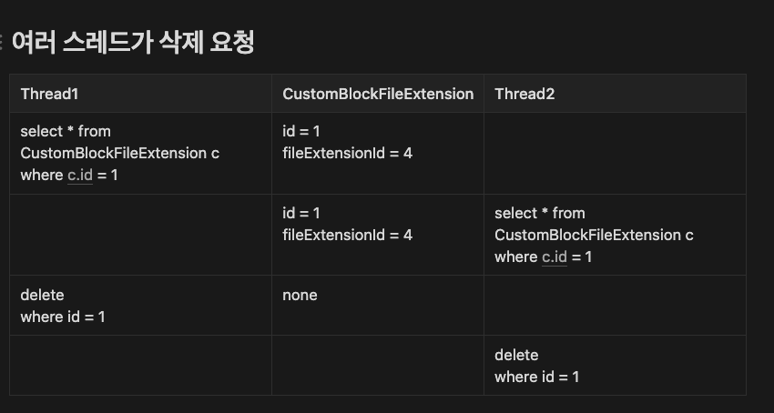
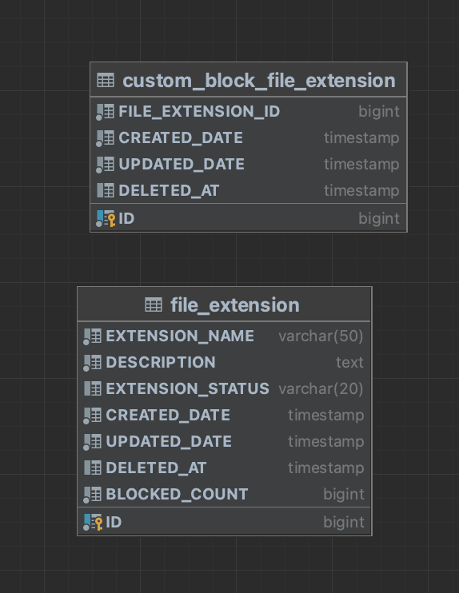
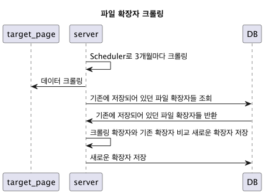
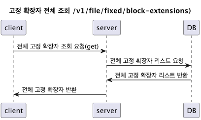
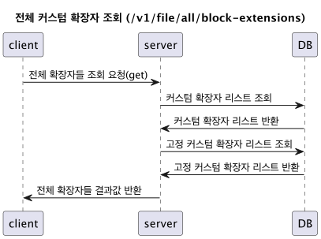
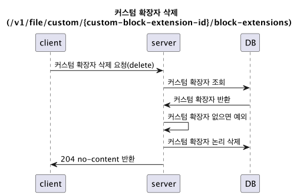
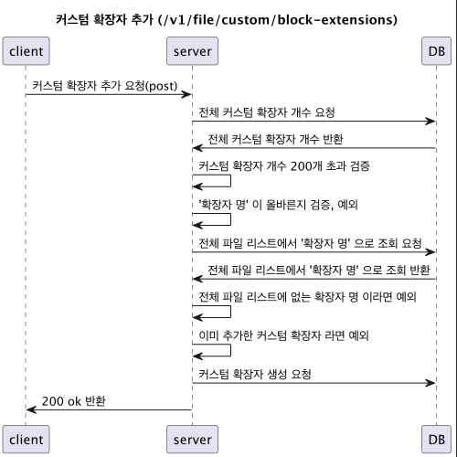

# 파일 확장자 차단 과제

## 1. 결과
1. api 명세서 링크 : https://file-extension-blocker-wellbeing-dough.store/swagger-ui/index.html#/
2. 결과물 링크 : https://file-extension-blocker-front.vercel.app/

## 2. 고려 사항
### 1. 세상에 없는 이름의 커스텀 확장자를 추가하려 하면 어떡하지?
- 3개월 마다 나무위키 파일 확장자 목록(https://namu.wiki/w/%ED%99%95%EC%9E%A5%EC%9E%90/%EB%AA%A9%EB%A1%9D) 크롤링
- 기존 데이터베이스와 비교하여 추가된 것들만 file_extension 테이블에 저장
- OOME를 고려하여 유저가 적은 새벽 시간에 크롤링
- [result.csv](src%2Fmain%2Fresources%2Fcrawling-result%2Fresult.csv) 크롤링 결과 데이터베이스에 저장된 데이터

### 2. 확장자 형식에 맞지 않은 커스텀 확장자를 추가하려 하면 어떡하지?
- ".jpg", "jpg" 이렇게 앞에 점 정도만 허용 + (3DMARK-RESULT | 9.PNG | _PLAYMUSICID | AZ! | AP_ | OVPN) 이런 예외적인 파일 확장명 허용
- [ExtensionName.java](src%2Fmain%2Fjava%2Fcom%2Fextension%2Fblock%2Fextension%2Fdomain%2Fcomponent%2FExtensionName.java) 
값 객체를 활용하여 파일 확장자 관리, 예외 처리 
- 정규 표현식: 시작에 선택적으로 마침표, 느낌표, 언더스코어 중 하나가 올 수 있고, 중간에는 알파벳 대문자, 숫자, 하이픈, 언더스코어, 끝에는 선택적으로 마침표, 하이픈, 언더스코어, 느낌표 중 하나가 올 수 있다
- 해당 값 객체를 이용하여 확장자 명 소문자, 대문자 변환 통일 (DB에는 대문자 저장, 클라이언트 요청/반환 값은 소문자)

### 3. 동시에 여러 클라이언트가 같은 이름의 커스텀 확장자를 추가하면 어떡하지?

- 동시성 처리
- synchronize 키워드 vs Pessimistic Lock vs Redisson
  - redisson은 성능이 좋지만 성능이 필요한 기능도 아닌 것 같다고 생각했음
  - synchronize는 ec2서버가 여러개 있다면 동시성 이슈를 막을 수 없음
  - Pessimistic Lock 은 성능 이슈와 데드락 이슈가 있음
  - 결론: Pessimistic Lock 쿼리 짜놓고 유동적으로 synchronize키워드와 변경할 수 있게 추후에 성능이 필요해지면 redisson 도입
    하지만 개인적으로 성능이 필요해지면 member 테이블이랑 같이 로그인 서비스가 되어 redisson을 도입할 가능성은 적어 보임

### 4. 동시에 여러 클라이언트가 같은 id의 커스텀 확장자를 삭제하면 어떡하지?
- 
- 동시성 처리
- synchronize 키워드 vs Pessimistic Lock vs Redisson
  - redisson은 성능이 좋지만 성능이 필요한 기능도 아닌 것 같다고 생각했음
  - synchronize는 ec2서버가 여러개 있다면 동시성 이슈를 막을 수 없음
  - Pessimistic Lock 은 성능 이슈와 데드락 이슈가 있음
  - 결론: Pessimistic Lock 쿼리 짜놓고 유동적으로 synchronize키워드와 변경할 수 있게 추후에 성능이 필요해지면 redisson 도입 
하지만 개인적으로 성능이 필요해지면 member 테이블이랑 같이 로그인 서비스가 되어 redisson을 도입할 가능성은 적어 보임

### 5. 커스텀 확장자 추가 중복 방지
- 서버 예외처리

### 6. 커스텀 확장자 200개 까지 추가 가능
- 서버, 클라이언트 둘 다 예외 처리

### 7. 확장자 최대 입력 길이 20자리
- 서버 클라이언트 둘 다 예외 처리

## 3. 인프라

### 1. ERD

- file_extension
  - 전체 파일 확장자 (크롤링 한 결과 저장)
  - EXTENSION_NAME: 확장자 명
  - DESCRIPTION: 확장자 설명
  - BLOCKED_COUNT: 커스텀에서 차단된 개수
  - EXTENSION_STATUS: 확장자 상태 ex) BLOCK_FIXED(고정 차단), SAFE(안전), BLOCKED(차단)
- table custom_block_file_extension
  - 커스텀 차단 파일 확장자
  - FILE_EXTENSION_ID: 전체 파일 확장자 PK

### 2. 아키텍처

- JavaScript + React Frontend 사이트 개발, vercel 사용하여 배포
- Spring Boot + MySQL로 서버 개발, AWS Elastic Beanstalk, RDS 사용하여 배포
- AWS Route 53 + Cetificate Manager + ALB로 백엔드 서버 HTTPS 설정

## 4. UML

